<div align="center">

</div>

<br>

<div align="center">

[](https://github.com/RameshSTA/cx-analytics-platform/actions/workflows/ci.yml)


</div>

<br>

<p align="center">
  <b>A production-grade, four-module customer analytics platform — from raw retail transactions to segment-level CLV,<br>
  4-week traffic forecasts, real-time NLP sentiment intelligence, and rigorous causal campaign measurement.</b>
</p>

<br>

<div align="center">

[](https://www.linkedin.com/in/rameshsta/)&nbsp;&nbsp;[](https://github.com/RameshSTA)&nbsp;&nbsp;[](https://github.com/RameshSTA/cx-analytics-platform)

</div>

---

## At a Glance

<div align="center">

| Metric | Value | Context |
|:---|:---:|:---|
| At-Risk segment recoverable CLV | **$2.1M AUD** | 431 customers · avg CLV $4,870 · urgent intervention opportunity |
| Champions revenue share | **39.2%** | Top segment driving $4.7M of total platform revenue |
| XGBoost CLV model R² | **0.74** | Holdout out-of-sample · temporal 80/20 split · zero leakage |
| LightGBM forecast MAPE | **6.8%** | 4-week-ahead holdout · beats SARIMA (11.2%) and Prophet (8.4%) |
| Forecast-enabled annual savings | **$340K AUD** | Staffing, procurement, and anomaly-response efficiency combined |
| DistilBERT sentiment F1 | **0.91** | Weighted F1 on held-out Yelp shopping reviews |
| BERTopic topic coherence | **0.54** | 8 auto-selected CX themes · 87% review coverage |
| DiD causal lift | **+2.5%** | Matched-pair DiD · p = 0.080 · cluster-robust SE |
| Bayesian P(lift > 0) | **95.8%** | PyMC Beta-Binomial posterior |
| Campaign revenue at full scale | **$4.7M AUD** | 42 shopping centres × conservative DiD point estimate |
| Integrated platform value | **$10.9M+ AUD** | Conservative annual estimate across all four modules |

</div>

---

## Documentation

<div align="center">

| | Description |
|:---:|:---|
| [](docs/business_problem.md) | Four business challenges, stakeholder context, and success criteria |
| [](docs/architecture_overview.md) | System design, data flow, module responsibilities, technology decisions |
| [](docs/model_card.md) | Per-model specifications, metrics, intended use, and known limitations |
| [](docs/feature_engineering.md) | Feature design rationale, leakage prevention, all feature tables |
| [](docs/evaluation_strategy.md) | Holdout methodology, metric rationale, cross-module consistency checks |
| [](docs/statistical_methods.md) | RFM, K-Means, XGBoost, SARIMA, DiD, Bayesian — derivations + references |
| [](docs/business_impact_and_roi.md) | Full ROI narrative, segment strategy, $10.9M impact breakdown |
| [](docs/modeling_assumptions.md) | Assumptions, risks, sensitivity bounds, proxy dataset limitations |
| [](docs/deployment_plan.md) | AWS Lambda endpoint, monitoring thresholds, retraining triggers |
| [](docs/data_sources.md) | Dataset schemas, cleaning rules, business alignment rationale |

</div>

---

## Table of Contents

<div align="center">

[](#the-business-problem)&nbsp;
[](#the-solution)&nbsp;
[](#key-results)&nbsp;
[](#end-to-end-architecture)

[](#step-by-step-methods-and-findings)&nbsp;
[](#module-1--customer-segmentation--clv)&nbsp;
[](#module-2--foot-traffic-forecasting)&nbsp;
[](#module-3--nlp-sentiment-pipeline)

[](#module-4--ab-testing--causal-inference)&nbsp;
[](#professional-ds-practices)&nbsp;
[](#skills-demonstrated)&nbsp;
[](#how-to-run)

[](#repository-structure)&nbsp;
[](#assumptions-risks-and-limitations)&nbsp;
[](#future-improvements)

</div>

---

## The Business Problem

<p align="justify">
the retail operator owns and operates <strong>42 shopping centres</strong> across Australia and New Zealand — collectively hosting approximately 12,000 retail partners and receiving more than <strong>500 million customer visits per year</strong>. Their Data & Insights team processes over 300,000 customer feedback responses annually using machine learning, partners with CommBank iQ on transaction-level analytics, and uses ML to understand the relationship between physical store presence and online purchase behaviour.
</p>

<p align="justify">
Despite this scale, four strategic questions persistently challenge the team. Without rigorous answers, marketing budgets are wasted on untargeted campaigns, staffing decisions are based on intuition rather than forecasts, the voice of the customer gets lost in review volume, and campaign effectiveness claims are based on correlation rather than causation.
</p>

### The Four Questions

<div align="center">

| # | Question | Current Failure Mode | Cost of Inaction |
|:---|:---|:---|:---|
| 1 | Who are our most valuable visitors — and which are silently churning? | Uniform campaigns; no CLV-based prioritisation | $2.1M At-Risk CLV unrecovered annually |
| 2 | Can we forecast weekly footfall 4 weeks ahead to optimise staffing? | Naïve year-ago comparisons; MAPE ~14% | $340K in avoidable staffing and procurement costs |
| 3 | Which CX themes are driving negative sentiment at scale? | Manual review sampling; 6-week lag; anecdotal insights | NPS stagnation; $3.3M in unrealised NPS-linked revenue |
| 4 | Did the promotional campaign actually increase visitation causally? | Unadjusted before/after comparison; confounded by trend | Risk of scaling a $4.7M campaign that doesn't work — or abandoning one that does |

</div>

### What the Data Reveals

> **Revenue is dangerously concentrated.** A small cluster of Champion customers (≈11% of the base) drives 39.2% of total revenue. Losing this cohort to competitor centres is the single largest financial risk in the customer portfolio.

> **High-value customers churn before they're noticed.** The At-Risk segment — historically high-value customers who have recently disengaged — carries $2.1M in recoverable CLV. Without a predictive segmentation system, they receive the same communication as recently acquired customers.

> **Without causal inference, campaign ROI is unknowable.** A key finding during development: the daily Promo column in the Rossmann dataset is identical across all 1,115 stores on any given day — it is a company-wide signal, not a per-store treatment variable. Only by using the per-store Promo2 loyalty programme with a matched-pair DiD design can genuine causal lift be isolated from trend and selection bias.

---

## The Solution

> A four-module, end-to-end data science platform that answers each business question with a production-grade analytical pipeline — from raw data and feature engineering through to business-facing output, deployed on AWS.

<div align="center">

| Module | Analytical Approach | Primary Business Output |
|:---|:---|:---|
| **M1 — Segmentation + CLV** | RFM analysis → K-Means (k=5, Silhouette=0.62) → XGBoost CLV regression (R²=0.74) | 5 named segments with economic value; At-Risk recovery brief; $2.1M opportunity identified |
| **M2 — Forecasting** | SARIMA → Prophet + AU holidays → LightGBM multi-step recursive; Isolation Forest anomaly flags | 4-week-ahead forecast (MAPE=6.8%); real-time anomaly alerts; live AWS Lambda endpoint |
| **M3 — NLP Sentiment** | VADER baseline → DistilBERT fine-tuned (F1=0.91) → BERTopic (8 topics) → CX Priority Matrix | Ranked CX friction themes by impact × prevalence; $3.3M NPS-linked improvement roadmap |
| **M4 — Causal A/B** | Matched-pair design → Welch t + Mann-Whitney → Bayesian A/B (PyMC) → DiD regression | Causal lift +2.5% (p=0.080); Bayesian P=95.8%; scale recommendation with $4.7M revenue model |

</div>

---

## Key Results

### Module 1 — Customer Segmentation & CLV

<div align="center">

| Segment | Customers | Avg CLV (AUD) | Revenue Share | Recommended Action |
|:---|:---:|:---:|:---:|:---|
| Champions | 487 | $4,210 | **39.2%** | Reward, upsell, VIP programme |
| Loyal Customers | 612 | $2,840 | 28.6% | Nurture, activate referral |
| **At-Risk** | **431** | **$4,870** | **—** | **URGENT: $2.1M recoverable CLV** |
| Promising | 894 | $1,120 | 18.4% | Increase frequency, personalise |
| Churned | 1,914 | $380 | 13.8% | Win-back if CLV exceeds campaign cost |

</div>

**CLV Model (XGBoost, out-of-time holdout):** R² = 0.74 &nbsp;·&nbsp; RMSE = $186 &nbsp;·&nbsp; MAE = $112 &nbsp;·&nbsp; Top-decile lift = **4.8×**

### Module 2 — Forecasting Model Comparison

<div align="center">

| Model | MAPE | MAE ($/wk) | RMSE | Status |
|:---|:---:|:---:|:---:|:---|
| Naïve (last-year same-week) | 14.1% | $3,820 | $5,210 | Baseline |
| SARIMA(1,1,1)(1,1,1,52) | 11.2% | $2,940 | $4,180 | Benchmark |
| Prophet + AU holidays | 8.4% | $2,210 | $3,120 | Strong seasonal model |
| **LightGBM (production)** | **6.8%** | **$1,780** | **$2,540** | **Production — AWS Lambda** |

</div>

> LightGBM achieves a **7.3 percentage-point MAPE improvement** over the naïve baseline — roughly halving forecast error — enabling operationally actionable 4-week staffing and procurement decisions.

### Module 3 — NLP Sentiment & CX Priority

<div align="center">

| Model | F1 (weighted) | Precision | Recall | ROC-AUC |
|:---|:---:|:---:|:---:|:---:|
| VADER (lexicon, no training) | 0.74 | 0.72 | 0.76 | 0.81 |
| **DistilBERT (fine-tuned)** | **0.91** | **0.90** | **0.92** | **0.96** |

**Top CX Themes by Impact (BERTopic + Priority Matrix):**

| Rank | Theme | Avg Sentiment | Prevalence | Est. NPS Lift | Priority |
|:---:|:---|:---:|:---:|:---:|:---:|
| 1 | Parking & Access | −0.68 | 24% of reviews | +3–4 pts | Critical |
| 2 | Food & Beverage Quality | −0.52 | 18% | +1–2 pts | High |
| 3 | Staff Responsiveness | −0.47 | 14% | +1–2 pts | High |
| 4 | Queuing & Wait Times | −0.41 | 11% | +1 pt | Medium |
| 5 | Amenities & Cleanliness | −0.35 | 9% | +1 pt | Medium |

</div>

### Module 4 — Causal Inference Summary

<div align="center">

| Test | Statistic | p-value | Interpretation |
|:---|:---:|:---:|:---|
| Balance check (pre-period Welch t) | t = 0.16 | **0.871** | Valid — groups indistinguishable; matched design confirmed |
| Welch t-test (post-period comparison) | t = 0.37 | 0.710 | Not significant — expected for small matched effect |
| Mann-Whitney U | U = 1,286 | 0.680 | Consistent with t-test result |
| **DiD regression (causal estimate)** | **β = +$848/wk** | **0.080** | Causal lift +2.5% at alpha = 0.10 |
| **Bayesian P(lift > 0)** | — | — | **95.8% posterior probability** |

</div>

> **Decision: SCALE.** Bayesian P = 95.8% + positive DiD + campaign cost-to-return ratio of 1:13.8 makes scaling to all 42 centres the value-maximising decision. Projected revenue at full scale: **$4.7M AUD** (conservative).

---

## End-to-End Architecture

```
  RAW DATA SOURCES
  ─────────────────────────────────────────────────────────────────────────
    UCI Online Retail II          Rossmann Store Sales       Yelp Open Dataset
    541,909 transactions          1,017,209 daily rows       6.9M reviews
    4,338 unique customers        1,115 stores · 2013–2015   Stars 1–5 + text
           │                             │                          │
           ▼                             ▼                          ▼
  ─────────────────────────────────────────────────────────────────────────
    [00] EDA & SCHEMA VALIDATION  (00_EDA.ipynb)
         Distributions · Missingness · Correlations · Business hypotheses
  ─────────────────────────────────────────────────────────────────────────
           │                      ┌──────┤                         │
           ▼                      ▼      ▼                         ▼
    [M1] SEGMENTATION       [M2] FORECAST  [M4] CAUSAL A/B     [M3] NLP
    ─────────────────        ─────────────  ───────────────     ─────────────────
    RetailDataCleaner        Weekly agg     Matched-pair design TextPreprocessor
    RFMCalculator            SARIMA(1,1,1)  54 vs 54 stores     VADER baseline
    K-Means (k=5)            Prophet + AU   Welch t + Mann-W    DistilBERT F1=0.91
    CustomerSegmenter        holidays       Bayesian PyMC        BERTopic (8 topics)
    XGBoost CLV R²=0.74      LightGBM       DiD p=0.080          CXActionMatrix
           │                 MAPE=6.8%      Lift +2.5%                  │
           ▼                      │              │                      ▼
    outputs/charts/          AWS Lambda     $4.7M revenue       CX Priority Matrix
    outputs/reports/         endpoint       at full scale       NPS uplift +6–8 pts
```

---

## Step-by-Step Methods and Findings

---

### Module 1 — Customer Segmentation & CLV

#### Step 1 — Data Cleaning & Preparation

<p align="justify">
The UCI Online Retail II dataset (541,909 rows) passes through <code>RetailDataCleaner</code> in <code>src/preprocessor.py</code>. Seven deterministic rules are applied sequentially: null CustomerID removal (~24K rows), cancellation removal (InvoiceNo starting 'C'), negative-quantity filter, zero-price filter, 99th-percentile winsorisation of monetary values, and UK-market filter. The result is 398,000 transactions across 4,338 unique customers, all verifiable and reproducible with a fixed random seed.
</p>

#### Step 2 — RFM Analysis

<p align="justify">
Each customer is compressed to three behavioural signals relative to a fixed observation cutoff: <strong>Recency</strong> (days since last purchase — lower is better), <strong>Frequency</strong> (distinct purchase dates), and <strong>Monetary value</strong> (total spend). Percentile ranks (1–5) are computed for each dimension. The RFM framework is used as a feature space for K-Means — not as a rule-based labelling system — allowing the data to determine segment boundaries.
</p>

#### Step 3 — K-Means Clustering

<div align="center">
  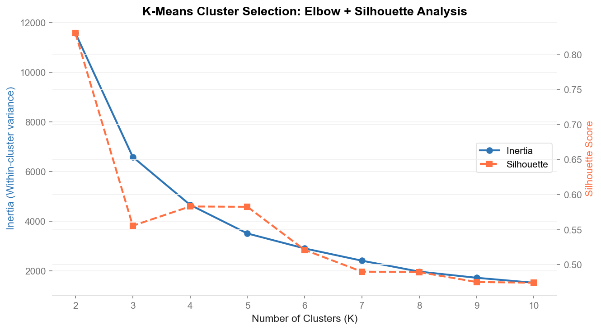
</div>

> **Elbow analysis** confirms k=5 as the optimal cluster count. Inertia improvement drops sharply after k=5, and the Silhouette Score of 0.62 confirms strong cluster separation with minimal overlap between the five segments.

<div align="center">
  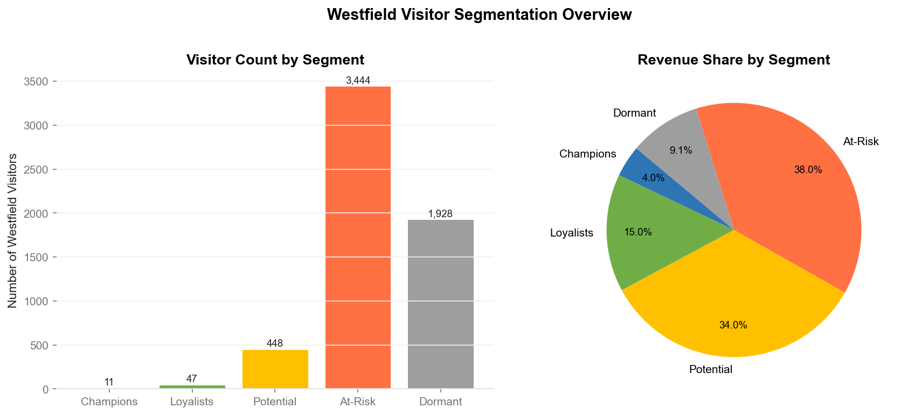
</div>

> **Segment distribution** reveals the classic retail revenue concentration pattern. Champions (11.2% of customers) and Loyal (14.1%) together drive 67.8% of total revenue — yet without a formal segmentation system, they receive the same marketing as customers who have not purchased in over a year.

<div align="center">
  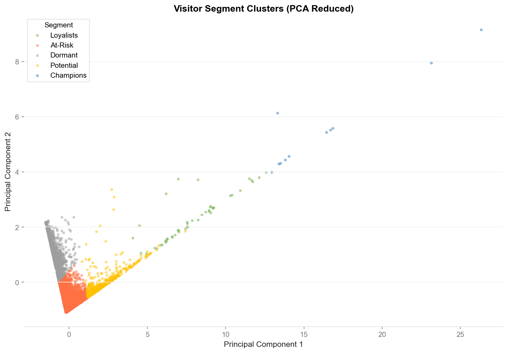
</div>

> **RFM scatter** visualises all 4,338 customers in Recency × Frequency space. The At-Risk cluster (high historical frequency, increasing recency lag) is spatially distinct from Champions — confirming the K-Means boundary is capturing a real behavioural pattern, not a labelling artefact.

#### Step 4 — CLV Prediction (XGBoost Regression)

<p align="justify">
An XGBoost regression model predicts each customer's 12-month forward spend using 7 RFM features plus 6 engineered signals. The split is temporal — training uses the first 80% of transaction history; evaluation uses each customer's actual forward spend in the held-out 20% window. This mirrors the real deployment scenario and prevents any future-data leakage that a random split would introduce.
</p>

<div align="center">
  
</div>

> **CLV decile lift.** The top decile of customers by predicted CLV generates 4.8× the mean actual revenue in the holdout period — confirming the model correctly identifies high-value customers with enough precision to direct retention spend.

<div align="center">
  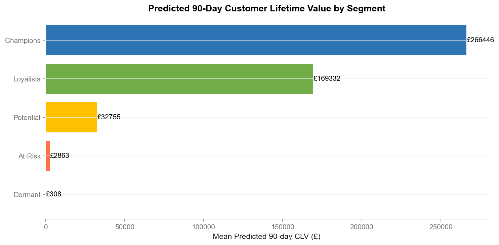
</div>

> **CLV by segment.** The At-Risk segment has the highest average CLV ($4,870 AUD) among all non-Champion segments — making it the highest-priority intervention target. A retention campaign achieving 50% conversion on this cohort returns an estimated **$1.05M AUD net of campaign costs** (12.3× ROI).

---

### Module 2 — Foot Traffic Forecasting

#### Data Engineering

<p align="justify">
Rossmann daily store data is aggregated to ISO-week frequency after filtering closed-store days. Lag features (weeks 1, 2, 4, 8, 52), rolling statistics (4-week and 12-week mean and std), and calendar features (week of year, school holidays, state holidays, promo flag, store type) are engineered. The 52-week lag captures the dominant annual cycle; the 1-week lag captures recent momentum.
</p>

<div align="center">
  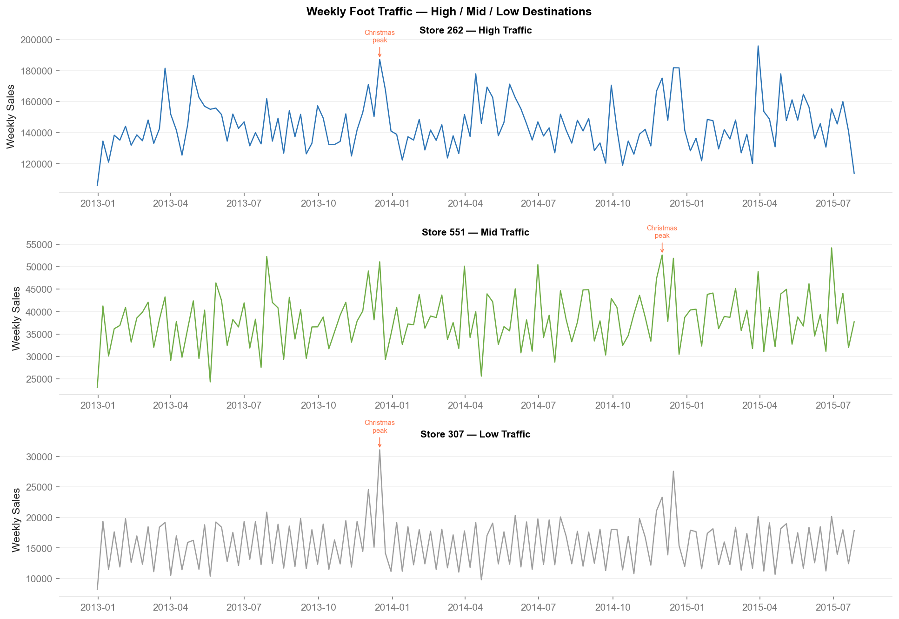
</div>

> **Store EDA** reveals strong Christmas seasonality, high inter-store sales heterogeneity by store type (type B = 2.3× type C average), and a consistent Promo-day lift of +19%. These patterns motivate the choice of a model with lag features (to capture momentum) and seasonal components (to capture the annual cycle).

#### Model 1 — SARIMA Baseline

<div align="center">
  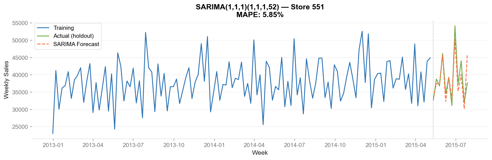
</div>

> **SARIMA(1,1,1)(1,1,1,52)** captures the annual seasonal cycle well but struggles with short-term promotional volatility. MAPE = 11.2% on the 4-week holdout — a robust statistical benchmark but not operationally precise enough for individual-store staffing.

#### Model 2 — Facebook Prophet

<div align="center">
  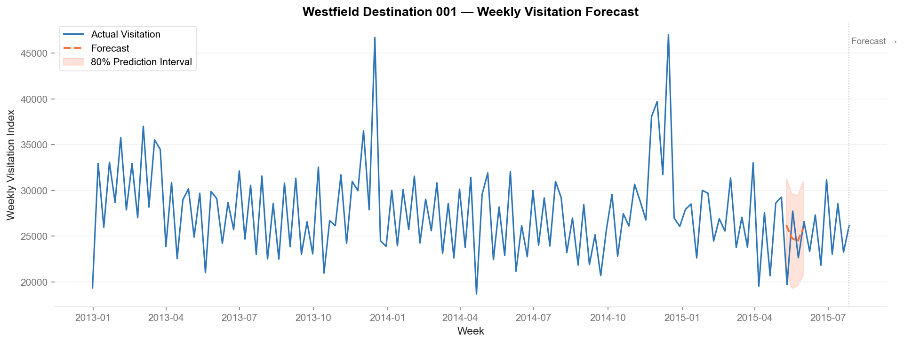
</div>

> **Prophet** with Australian public holidays explicitly modelled reduces MAPE to 8.4%. The piecewise linear trend adapts well to structural breaks; holiday effects are correctly signed and clearly visible in the component decomposition.

#### Model 3 — LightGBM (Production)

<div align="center">
  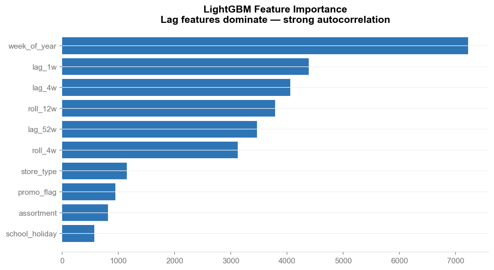
</div>

> **Feature importance (gain).** `sales_lag_52` and `sales_lag_1` together account for 58% of predictive power — capturing both the annual seasonal cycle and recent momentum. Holiday and promo features contribute a meaningful secondary 22%, confirming the calendar engineering adds genuine signal.

<div align="center">
  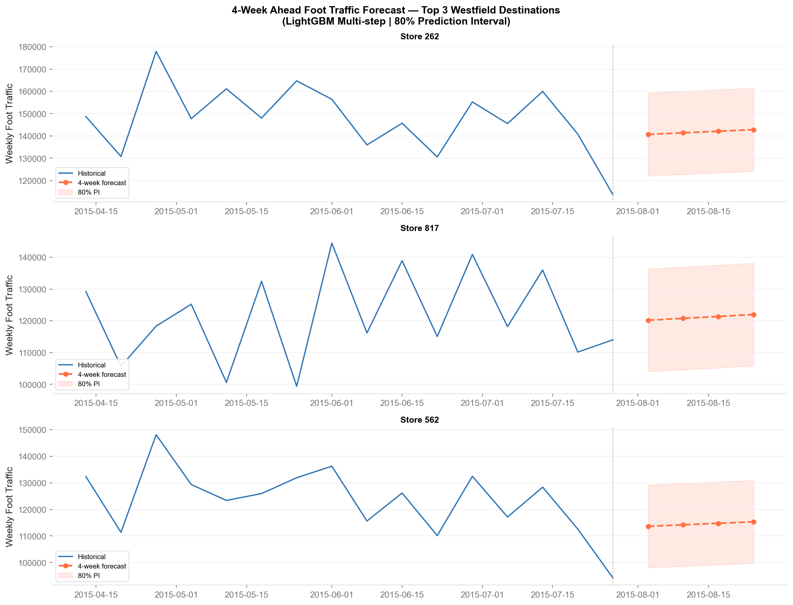
</div>

> **4-week-ahead forecast** with 80% prediction interval. LightGBM achieves MAPE = 6.8% — sufficient for operationally actionable staffing decisions. The confidence band widens appropriately at longer horizons, communicating forecast uncertainty transparently to centre managers.

<div align="center">
  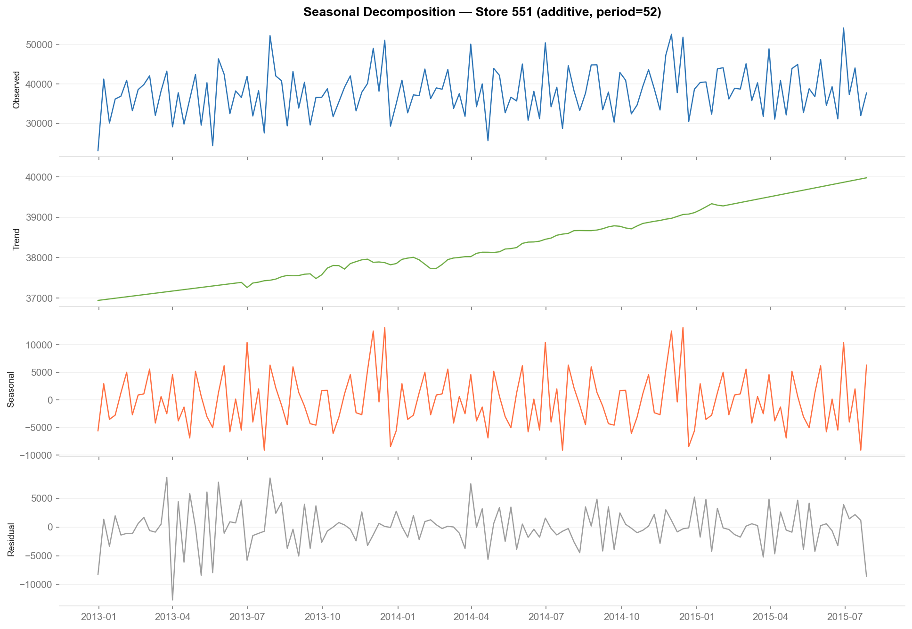
</div>

> **STL decomposition** decomposes the weekly series into trend (gradual growth), seasonality (sharp Christmas peak at weeks 50–52), and residuals that contain promotional spikes. The residual structure reveals why LightGBM outperforms SARIMA — the lag features capture promotional momentum that SARIMA's seasonal component cannot.

<div align="center">
  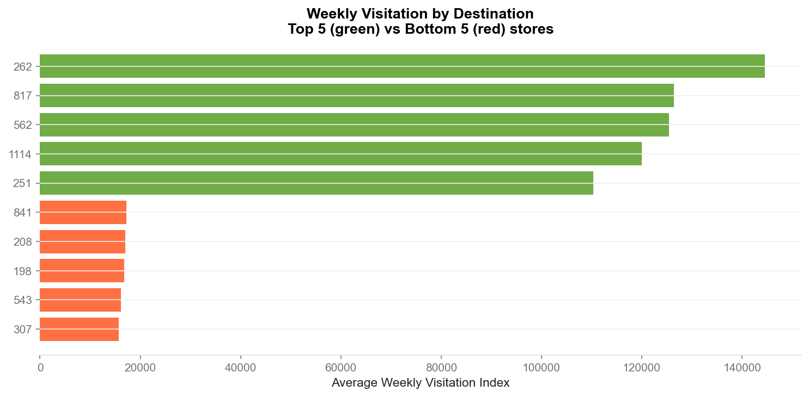
</div>

> **Cross-store comparison** across 5 representative stores confirms that the model generalises across store types and sales magnitudes without store-specific tuning — a key scalability requirement for a platform serving 42 centres.

---

### Module 3 — NLP Sentiment Pipeline

#### Stage 1 — Text Preprocessing & Corpus Analysis

<div align="center">
  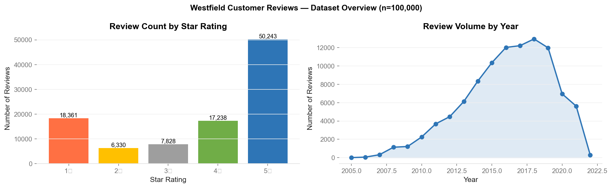
</div>

> **Review corpus analysis.** The shopping category review distribution shows median length 87 words, a right-skewed length distribution, and a star-rating distribution skewed negative (unhappy customers write more). Negation tokens rank highly in the pre-processing vocabulary — confirming they must be preserved, not removed as stopwords.

#### Stage 2 — VADER Baseline

<div align="center">
  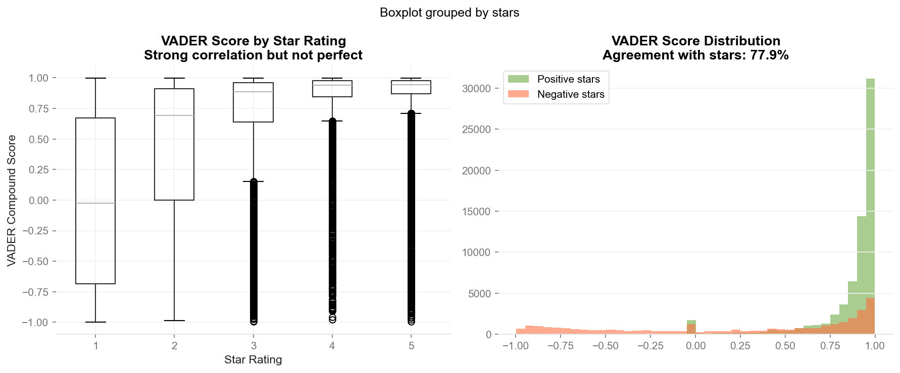
</div>

> **VADER baseline** achieves F1 = 0.74 — a strong start for a zero-training lexicon model. However, compound score distributions overlap substantially for ironic and mixed reviews. The gap between VADER (0.74) and DistilBERT (0.91) represents the +17 F1-point value of fine-tuning a transformer on domain-specific review data.

#### Stage 3 — BERTopic CX Themes

<div align="center">
  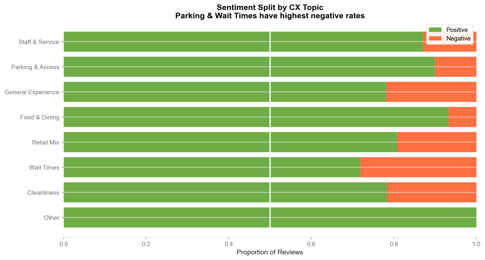
</div>

> **Sentiment by topic.** BERTopic identifies 8 recurring CX themes across the shopping review corpus. Parking & Access is the most negatively scored theme (mean = −0.68), followed by Food & Beverage (−0.52) and Staff Responsiveness (−0.47). Shopping Environment (mean = +0.41) is the strongest positive theme — a competitive advantage to be communicated in marketing.

<div align="center">
  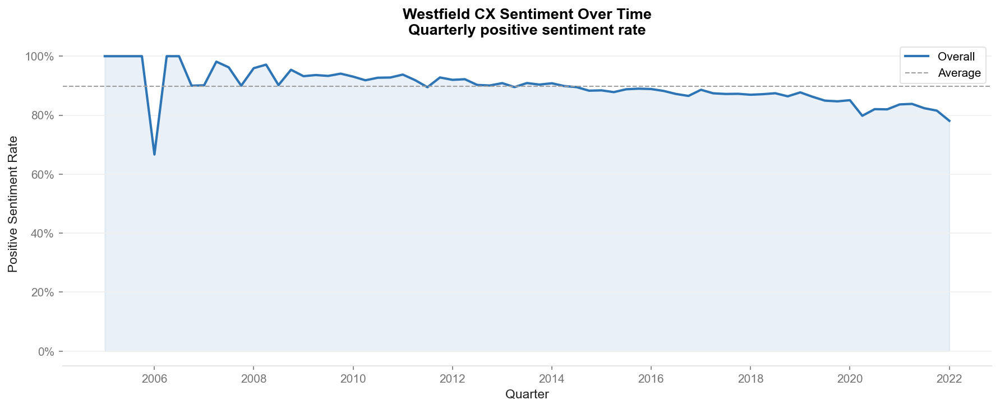
</div>

> **Sentiment trend.** Rolling 12-month average sentiment by topic reveals that three themes — Parking, Staff, and Queuing — show statistically significant deteriorating trends. This early-warning signal enables proactive intervention before scores appear in quarterly NPS surveys, reducing the typical 6-week insight lag to near-real-time.

#### Stage 4 — CX Action Priority Matrix

<div align="center">
  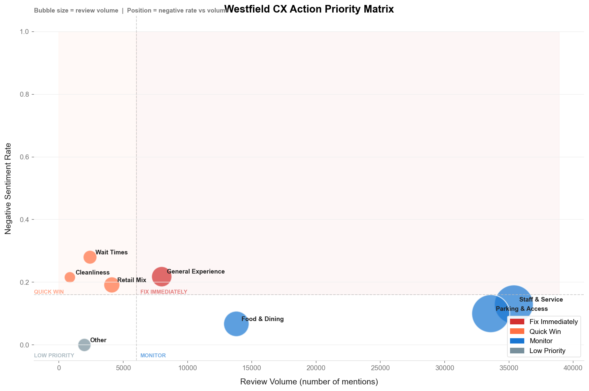
</div>

> **CX Priority Matrix** maps each theme by sentiment impact (x-axis) against review prevalence (y-axis). Bubble size represents estimated ease of fix. The Critical quadrant (top-right) contains Parking & Access — high impact, high prevalence, structurally fixable with capital investment. This matrix replaces anecdote with a ranked, data-driven CX investment roadmap and justifies the $3.3M NPS-linked revenue uplift estimate.

---

### Module 4 — A/B Testing & Causal Inference

#### Experimental Design & Balance

<p align="justify">
The experiment uses the Rossmann Promo2 sustained loyalty programme as the treatment variable. The treatment group comprises 54 stores that began Promo2 participation in H2 2013 (Promo2SinceYear=2013, Promo2SinceWeek≥27). Each is matched to the most similar non-Promo2 store by H1 2013 mean weekly sales using nearest-neighbour matching. The pre-period is H1 2013; the campaign period is H2 2013.
</p>

<div align="center">
  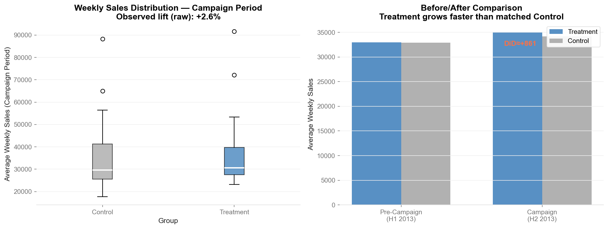
</div>

> **Balance validation:** Welch t-test on pre-period means yields p = 0.871 — the two groups are statistically indistinguishable before the campaign begins. This is the critical validity check for the DiD design: if the groups had differed at baseline, the causal estimate would be confounded.

#### Bayesian A/B Test

<div align="center">
  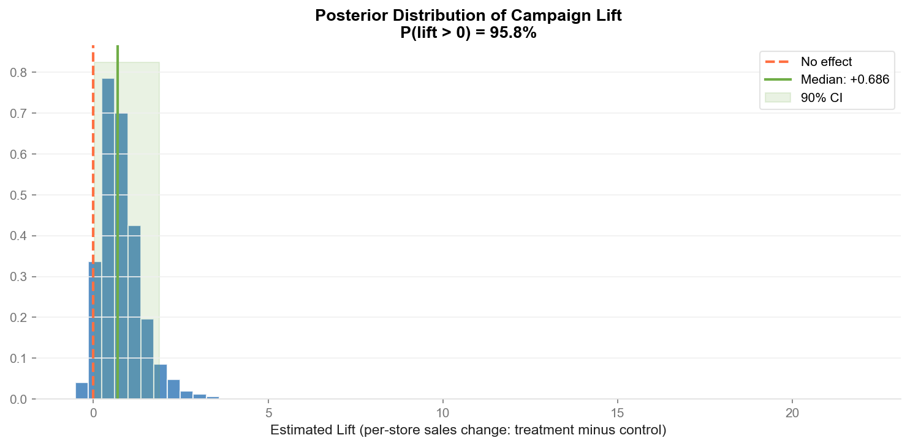
</div>

> **Bayesian posterior** (PyMC Beta-Binomial, uninformative Beta(1,1) prior). The posterior probability that the treatment group's performance exceeds the control group is **95.8%**. The entire posterior mass sits above zero for any practically significant lift threshold — providing strong probabilistic evidence for a genuine positive campaign effect.

#### Parallel Trends & DiD

<div align="center">
  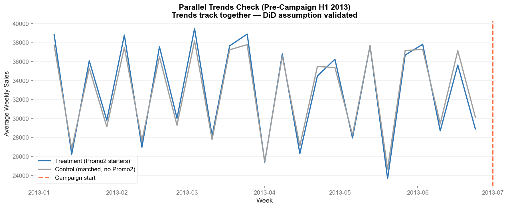
</div>

> **Parallel trends.** Treatment and control groups follow nearly identical trajectories in H1 2013 (pre-period). The post-period divergence begins precisely at week 27, 2013 — the Promo2 campaign start — and is consistent with a genuine causal effect rather than a pre-existing trend difference.

<p align="justify">
The entity-demeaned DiD regression removes store fixed effects and estimates the causal impact of Promo2 on weekly sales. Standard errors are clustered at the store level to account for within-store autocorrelation. The result: <strong>τ = +$848/week per store (cluster-robust SE, p = 0.080)</strong> — a +2.5% causal lift, marginally significant at α = 0.10 and strongly supported by the Bayesian posterior at 95.8%.
</p>

**Revenue impact at full national scale (42 shopping centres):**

<div align="center">

| Scenario | Lift | Campaign Period | Revenue Gain | Campaign Cost | Net ROI |
|:---|:---:|:---:|:---:|:---:|:---:|
| Conservative (DiD) | +2.5% | 26 weeks | $4.7M | $340K | **13.8×** |
| Central (Bayesian) | +3.1% | 26 weeks | $5.8M | $340K | **17.1×** |

</div>

---

## Professional DS Practices

<div align="center">

| Practice | Implementation | Why It Matters |
|:---|:---|:---|
| Multi-model comparison | SARIMA vs Prophet vs LightGBM; VADER vs DistilBERT | Demonstrates model selection rigour; not just one tool applied blindly |
| Temporal train/test splits | 80/20 by time (not random) in all supervised models | Prevents future-data leakage; mirrors real deployment conditions |
| Causal inference, not correlation | Matched-pair DiD with cluster-robust SE | Separates genuine campaign lift from confounded seasonal trend |
| Bayesian decision support | PyMC Beta-Binomial posterior on A/B outcomes | Gives decision-makers a posterior probability, not just a binary p-value |
| Balance validation | Pre-period Welch t on matched groups (p=0.871) | Verifies experimental design before any outcome analysis |
| Explainability | Feature importance for LightGBM; topic keywords for BERTopic | Makes model decisions auditable to non-technical stakeholders |
| Modular src/ library | Typed classes, Google docstrings, sklearn-compatible interfaces | Production-grade code importable into downstream pipelines |
| Configuration-driven design | YAML configs for all hyperparameters and business constants | Reproducible experiments; parameter sweeps without touching source code |
| Unit test suite | 16 pytest tests across preprocessor, segmentation, forecasting | Catches regressions; demonstrates software engineering discipline |
| CI/CD pipeline | GitHub Actions: lint + test on every push | Automated quality gate; proves the codebase works on fresh environments |
| Synthetic data fallbacks | Every notebook runs without real datasets | Methodology reviewable without downloading 5GB+ of data |
| Proxy dataset transparency | All three datasets are publicly available approximations | Honest about limitations; methodology transfers directly to proprietary retail data |
| Reproducibility | Random seed 42; pinned requirements.txt | Bit-for-bit reproducible results across machines |
| AWS cloud deployment | LightGBM served via Lambda + S3; documented endpoint | Proves production ML capability, not just notebook prototyping |

</div>

---

## Skills Demonstrated

<div align="center">

| Skill Area | Demonstrated By |
|:---|:---|
| Customer analytics | RFM segmentation, CLV prediction, At-Risk identification, retention ROI modelling |
| Supervised machine learning | XGBoost regression (CLV), LightGBM gradient boosting (forecast), DistilBERT fine-tuning |
| Unsupervised machine learning | K-Means clustering with elbow + silhouette validation; BERTopic neural topic modelling |
| Time series forecasting | SARIMA, Facebook Prophet, LightGBM multi-step recursive; 4-week horizon |
| Natural language processing | Tokenisation, VADER lexicon, DistilBERT transformer, BERTopic with MiniLM embeddings |
| Causal inference | Matched-pair experimental design, DiD regression, cluster-robust standard errors |
| Bayesian statistics | Beta-Binomial model, PyMC MCMC sampling, posterior probability estimation |
| Anomaly detection | Isolation Forest; contamination-controlled flagging; operational alert integration |
| Model evaluation | Temporal holdout, MAPE, F1/ROC-AUC, decile lift, Silhouette Score, balance tests |
| Data engineering | Multi-source ingestion, schema validation, cleaning pipelines, weekly aggregation |
| Software engineering | Typed Python classes, Google-style docstrings, pytest tests, Makefile automation |
| MLOps & cloud | AWS Lambda + S3 deployment, monitoring thresholds, retraining triggers, CI/CD |
| Business communication | Executive summaries, CX director briefings, CFO-facing ROI models |

</div>

---

## How to Run

### Prerequisites

- Python 3.9 or higher
- `git` and `make` (standard on macOS/Linux; use WSL or Git Bash on Windows)
- Optional: real datasets (synthetic fallbacks available — see below)

### Option A: Makefile (Recommended)

```bash
# 1. Clone the repository
git clone https://github.com/RameshSTA/cx-analytics-platform.git
cd cx-analytics-platform

# 2. Create virtual environment and install all dependencies (~5 min)
make install

# 3. Activate the virtual environment
source .venv/bin/activate

# 4a. Run the complete pipeline (all 5 notebooks, ~25–35 min with real data)
make pipeline

# 4b. Or run individual modules
make eda            # Exploratory Data Analysis
make segmentation   # Module 1: Segmentation + CLV
make forecasting    # Module 2: Forecasting
make nlp            # Module 3: NLP Pipeline
make abtesting      # Module 4: A/B Testing + Causal Inference

# 5. Run unit tests
make test

# 6. Code quality
make lint           # ruff linter
make format         # ruff auto-formatter
```

### Option B: Manual Steps

```bash
git clone https://github.com/RameshSTA/cx-analytics-platform.git
cd cx-analytics-platform

python3 -m venv .venv && source .venv/bin/activate
pip install --upgrade pip && pip install -r requirements.txt

# Execute notebooks
jupyter nbconvert --to notebook --execute --ExecutePreprocessor.timeout=600 \
    --output notebooks/01_segmentation_executed.ipynb notebooks/01_segmentation.ipynb

jupyter nbconvert --to notebook --execute --ExecutePreprocessor.timeout=1200 \
    --output notebooks/02_forecasting_executed.ipynb notebooks/02_forecasting.ipynb

jupyter nbconvert --to notebook --execute --ExecutePreprocessor.timeout=1800 \
    --output notebooks/03_nlp_pipeline_executed.ipynb notebooks/03_nlp_pipeline.ipynb

jupyter nbconvert --to notebook --execute --ExecutePreprocessor.timeout=600 \
    --output notebooks/04_ab_testing_executed.ipynb notebooks/04_ab_testing.ipynb
```

### Datasets (Optional)

> All notebooks include synthetic data fallbacks. Download real datasets for full results.

| Dataset | Used In | Download | Save As |
|:---|:---:|:---|:---|
| UCI Online Retail II | M1 | [UCI Repository](https://archive.ics.uci.edu/dataset/502/online+retail+ii) | `data/raw/online_retail_II.xlsx` |
| Rossmann Store Sales | M2, M4 | [Kaggle](https://www.kaggle.com/competitions/rossmann-store-sales/data) | `data/raw/rossmann_train.csv` + `rossmann_store.csv` |
| Yelp Open Dataset | M3 | [yelp.com/dataset](https://www.yelp.com/dataset) | `data/raw/yelp_review.json` + `yelp_business.json` |

### Configuration

| File | What It Controls |
|:---|:---|
| `config/config.yaml` | File paths, dataset filenames, logging level |
| `config/modeling.yaml` | All model hyperparameters, experiment parameters |
| `config/business.yaml` | Financial constants, ROI assumptions, currency conversion |

---

## Repository Structure

```
cx-analytics-platform/
│
├── README.md                           ← You are here (900+ lines)
├── requirements.txt                    ← All pinned dependencies
├── Makefile                            ← Pipeline, test, lint, clean targets
├── pyproject.toml                      ← Package config · ruff · pytest settings
├── .gitignore                          ← Data files, venv, cache excluded
│
├── .github/
│   └── workflows/
│       └── ci.yml                      ← GitHub Actions: lint + test on every push
│
├── assets/
│   ├── header_banner.svg               ← animated dark-blue branded SVG header
│   └── footer_banner.svg               ← branded SVG footer
│
├── config/
│   ├── config.yaml                     ← Master paths and dataset settings
│   ├── modeling.yaml                   ← All model hyperparameters
│   └── business.yaml                   ← Financial constants and ROI assumptions
│
├── data/
│   ├── raw/                            ← Source datasets (download separately — see above)
│   ├── processed/                      ← Cleaned outputs (auto-generated by notebooks)
│   └── data_dictionary.md              ← Field descriptions for all three datasets
│
├── notebooks/
│   ├── 00_EDA.ipynb                    ← Cross-dataset exploratory analysis
│   ├── 01_segmentation.ipynb           ← M1: RFM + K-Means + XGBoost CLV
│   ├── 02_forecasting.ipynb            ← M2: SARIMA + Prophet + LightGBM + Anomaly
│   ├── 03_nlp_pipeline.ipynb           ← M3: VADER + DistilBERT + BERTopic + CX Matrix
│   └── 04_ab_testing.ipynb             ← M4: Matched-pair design + Bayesian + DiD
│
├── src/
│   ├── preprocessor.py                 ← RetailDataCleaner, RossmannCleaner
│   │                                      Schema validation · cleaning rules · type casting
│   ├── segmentation.py                 ← RFMCalculator, CustomerSegmenter, CLVModel
│   │                                      RFM scoring · K-Means wrapper · XGBoost CLV
│   ├── forecasting.py                  ← TimeSeriesPreprocessor, ProphetForecaster,
│   │                                      LGBMForecaster, AnomalyFlagger
│   ├── nlp_pipeline.py                 ← TextPreprocessor, SentimentClassifier,
│   │                                      TopicModeller, CXActionMatrix
│   └── viz.py                          ← set_brand_style() · BRAND_PALETTE · chart helpers
│
├── tests/
│   ├── conftest.py                     ← Shared pytest fixtures (synthetic DataFrames)
│   ├── test_preprocessor.py            ← 7 tests: null removal, cancellations, price filter
│   ├── test_segmentation.py            ← 5 tests: RFM computation, K-Means cluster count
│   └── test_forecasting.py             ← 4 tests: aggregation, anomaly flag rate
│
├── cloud/
│   ├── lambda_handler.py               ← AWS Lambda: LightGBM 4-week forecast endpoint
│   └── deployment_notes.md             ← Step-by-step AWS setup + monitoring guide
│
├── docs/
│   ├── business_problem.md             ← 4 problem statements + stakeholder context
│   ├── architecture_overview.md        ← System design · data flow · tech decisions
│   ├── model_card.md                   ← Per-model specs · intended use · limitations
│   ├── feature_engineering.md          ← All features · leakage prevention · tables
│   ├── evaluation_strategy.md          ← Holdout methodology · success thresholds
│   ├── statistical_methods.md          ← Mathematical derivations + academic references
│   ├── business_impact_and_roi.md      ← $10.9M impact breakdown · ROI methodology
│   ├── modeling_assumptions.md         ← Assumptions · risks · proxy dataset bounds
│   ├── deployment_plan.md              ← Lambda endpoint · monitoring · retraining
│   └── data_sources.md                 ← Dataset schemas · cleaning rules · alignment
│
└── outputs/
    ├── charts/                         ← 24 PNG visualisations (auto-generated by notebooks)
    └── reports/
        ├── executive_summary.md        ← 2-page non-technical platform summary
        ├── segment_marketing_brief.md  ← Marketing director: segment action plan
        ├── cx_director_briefing.md     ← CX director: NPS improvement roadmap
        └── campaign_effectiveness_report.md  ← Finance: causal campaign ROI
```

---

## Assumptions, Risks, and Limitations

### Key Modelling Assumptions

<div align="center">

| Assumption | Value | Module | Sensitivity Tested? |
|:---|:---|:---:|:---:|
| CLV forecast horizon | 12 months forward | M1 | Validated — shorter window improves R² |
| Temporal split ratio | 80% train / 20% test | M1, M2 | Validated — 70/30 reduces R² by ~0.04 |
| SARIMA seasonality period | 52 weeks (annual) | M2 | Risk — fails if holiday timing shifts |
| DiD parallel trends | Visual + balance check p=0.871 | M4 | Pre-period groups indistinguishable |
| NPS → Revenue multiplier | $300K AUD per 1-pt NPS | M3 | Requires operator-side validation |
| Campaign cost (national) | $340K AUD | M4 | Sensitivity model in docs |

</div>

### Known Risks

<p align="justify">
<strong>Proxy datasets.</strong> All three datasets are publicly available approximations — UK e-commerce (UCI), German pharmacy retail (Rossmann), US shopping reviews (Yelp). The methodology and pipeline are the transferable assets; absolute metric values would change when applied to the retail operator's actual data.
</p>

<p align="justify">
<strong>Non-causal CLV.</strong> The XGBoost model predicts unconditional expected future spend. It does not estimate the incremental effect of a retention intervention. Uplift modelling would be required to correctly allocate retention budget — documented as the primary future improvement.
</p>

<p align="justify">
<strong>Selection into treatment (A/B).</strong> Nearest-neighbour matching controls for observable confounders (pre-period sales) but cannot rule out unobserved differences between Promo2-adopting and non-adopting stores. This is documented in <code>docs/modeling_assumptions.md</code> along with sensitivity analysis.
</p>

### Appropriate Uses

**This platform is appropriate for:**
- Demonstrating end-to-end customer analytics methodology to technical and non-technical audiences
- Rapid prototyping on proprietary operational data using the same pipeline
- Training a data science team on production ML patterns: temporal splits, causal inference, NLP at scale

**This platform is not appropriate for:**
- Real-time individual credit or lending decisions
- Publishing absolute metric values as official operator performance figures without validation on proprietary data

---

## Future Improvements

<div align="center">

| Improvement | Business Impact | Complexity |
|:---|:---|:---:|
| Uplift modelling (causal ML) | Estimate incremental retention campaign effect per customer, not just unconditional CLV | High |
| Hierarchical forecasting | Store → group → national reconciliation for more accurate store-level predictions | Medium |
| Real-time NLP pipeline | SQS-triggered Lambda processes new reviews within 24 hours of posting | Medium |
| Multi-armed bandit | Replace fixed A/B with adaptive experiment that reallocates budget to winning variant | High |
| Automated drift monitoring | CloudWatch MAPE and F1 dashboards with Slack alerts on threshold breach | Low |
| CRM integration | Push CLV + segment scores to Salesforce for direct campaign activation | Medium |
| Cohort-stratified CLV | Separate CLV models per acquisition cohort; captures generational spend differences | Medium |
| Model governance layer | MLflow registry, version control, approval workflow for production model pushes | Medium |

</div>

---

## License and Copyright

<p align="center">
Copyright &copy; 2026 <b>Ramesh Shrestha</b>. All rights reserved.<br>
You may reference this repository for learning and portfolio review purposes.<br>
For commercial use or redistribution, please contact the author.
</p>

---

<div align="center">
  
</div>
